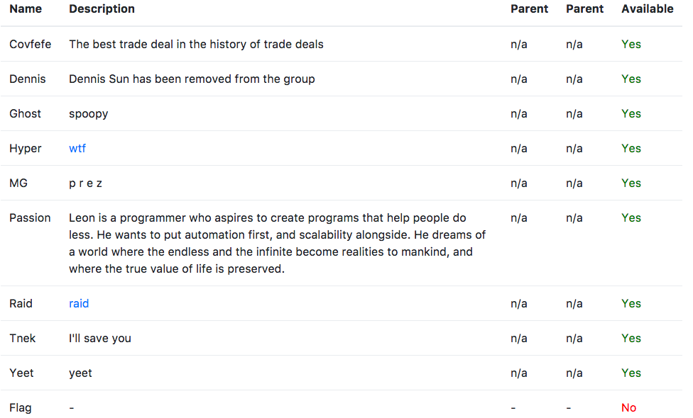
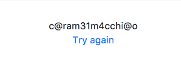
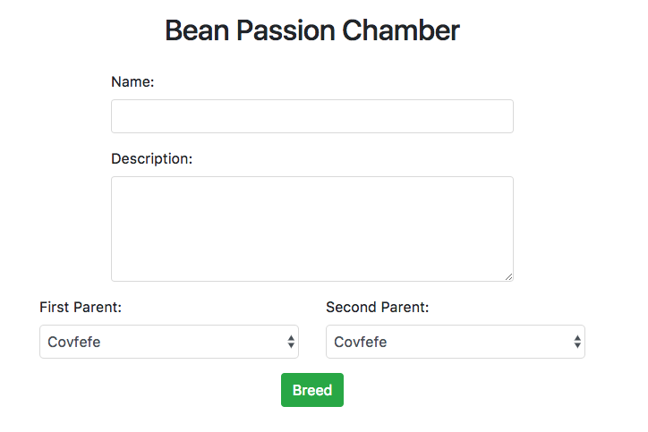
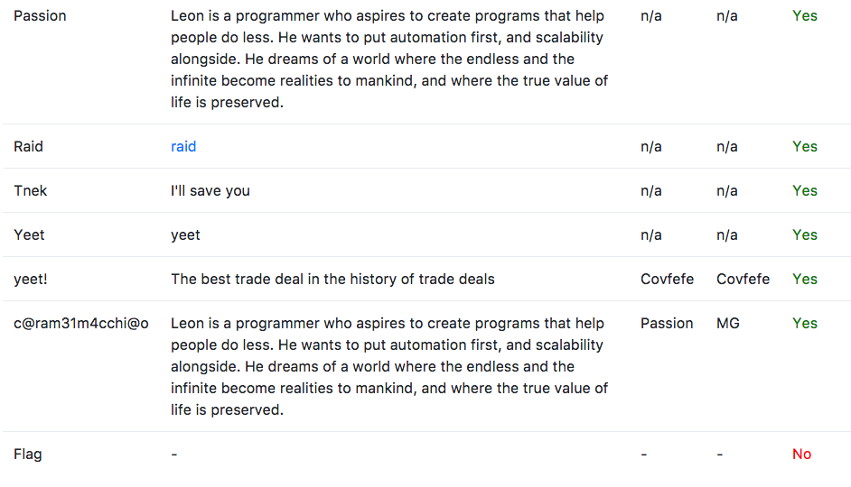
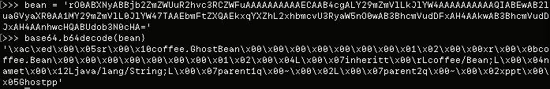
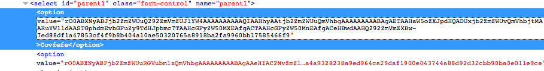
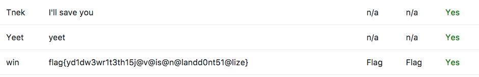

#Not My Cup of Coffee
## 300 points
## Web

#### I heard you liked food based problems, so here's a liquid one.
#### http://web.chal.csaw.io:8616

For this challenge, we were presented with a website to create hybrid coffee
beans or something. On the main page, a list is presented of all of the root
bean types. We're going to call them the root types since they don't have any
parent beans.



We did notice that a bean called flag was present, but appeared to be redacted
to some extent. At this point, we determined that the flag most likely resided
within that object somewhere. 

When we scrolled down the page, we found a link for an admin login. This login
forbids any non alphanumeric characters. But in an attempt to browse to 
`/admin.jsp` directly, an error was thrown:

```
25:           String result;
26:           // NOTE: Change $ to s when page is ready
27:           auth.loadPassword("Pas$ion");
28:           if (!guess.matches("[A-Za-z0-9]+")) {
29:             result = "Only alphanumeric characters allowed";
30:           } else {
31:             result = auth.lookup(guess.hashCode());
```

At this point, we were somewhat puzzled since we weren't quite sure how this 
tied into what we believed to be the objective to be. But we pressed on anyway.

As noted before, we knew that `Pas$ion` would not work for the login since we
were not allowed to include non alphanumeric characters in our password, so we
looked into what exactly java's [hashCode()](https://en.wikipedia.org/wiki/Java_hashCode()) is and how it works. 
This method returns a 32 bit signed integer, and it is computed byte-wise.
After looking a bit more into the implementation, we decided that it wouldn't 
be very hard to produce arbitrary collisions. A quick google gave us an
[implementation of hashCode() in python](https://gist.github.com/hanleybrand/5224673) that we borrowed to make a collision
[script](/hascode_collider.py) that accounts for the constraints of the permitted 
input. Using that yileded the result `ParDJon` that we could then use to login
to the admin page.



With this result, it wasn't immediately clear what to do next. We tried using
that and collisions with it to authenticated into the app, but that didn't
get us anywhere. Let's abandon this for now.

Moving into the breeding page, we are able to give our new breed a name, a
description, and parents. 



We noticed that if we left the description field blank, it would inherit the
description of the first parent. 



It became clear at this point that we needed to try to inherit the description
of the flag bean. In the breeding page form, the parent options appear to be
base64 encoded serialized bean object followed by a `-` and then finally some 
sort of hash corresponding to that object. 




We then selected the `Raid` bean to try to patch to be `Flag` since the names
are the same length to see what results that yields us. It turns out, that
doesn't really do much of anything. So now, we needed to figure out what this
hash wash.

Since this has was 256 bits, we figured it was probably SHA256, but were unable
to figure out what was being hashed. This was the most frustrating part of this
challenge. We were having to guess what the format for the input of this hash
might be, without knowing if it even was a hash in the first place. But we were
able to eventually get it.

Remember that string we got from logging in as admin before?

```
>>> import hashlib
>>> salt = 'c@ram31m4cchi@o'
>>> covfefe, covfefe_hash = 'rO0ABXNyABJjb2ZmZWUuQ292ZmVmZUJlYW4AAAAAAAAAAQIAA\
                                HhyAAtjb2ZmZWUuQmVhbgAAAAAAAAABAgAETAAHaW5oZXJ\
                                pdHQADUxjb2ZmZWUvQmVhbjtMAARuYW1ldAASTGphdmEvb\
                                GFuZy9TdHJpbmc7TAAHcGFyZW50MXEAfgACTAAHcGFyZW5\
                                0MnEAfgACeHBwdAAHQ292ZmVmZXBw-7ed88df1a47853cf\
                                4f9b8b404a10ae50320765a8918ba2fa9960bb17585466\
                                f9'.split('-')
>>> h = hashlib.sha256()
>>> h.update(covfefe + salt)
>>> h.hexdigest() == covfefe_hash
True
```

Ok, so now we can produce the corresponding hashes. Let's hope that our 
assumption about just changing the string in the serialized object before is
enough...



and boom goes the dynamite.

We put together a [solution script](win.py) if anyone is interested.
