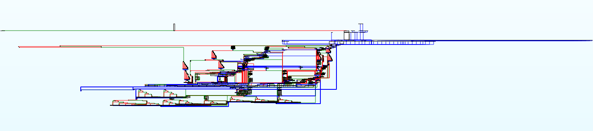
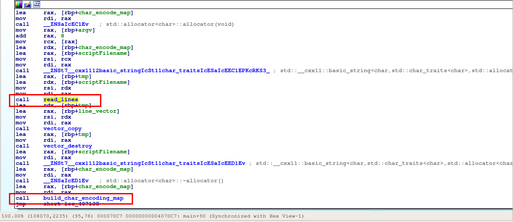
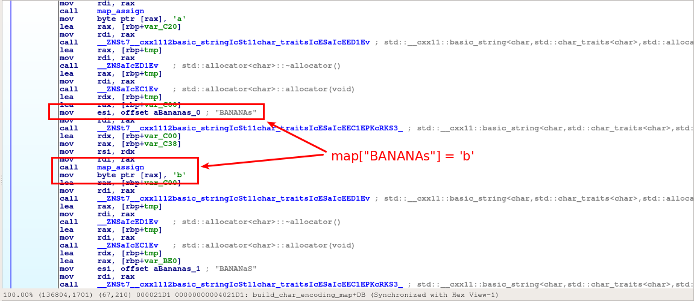
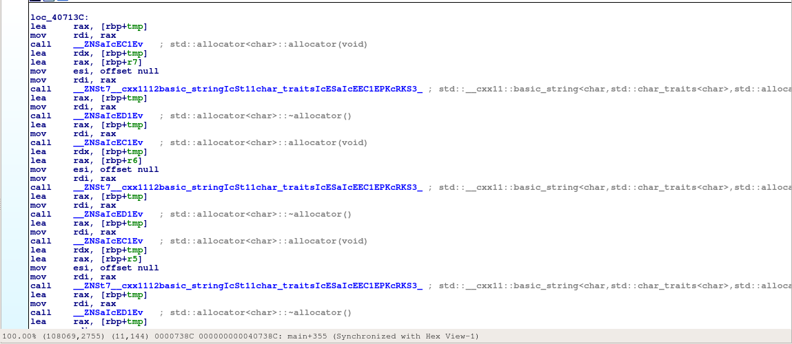
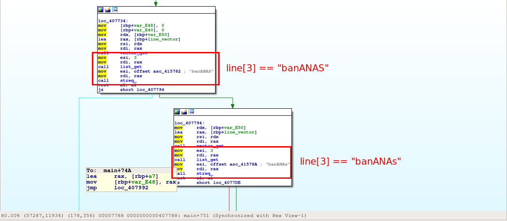
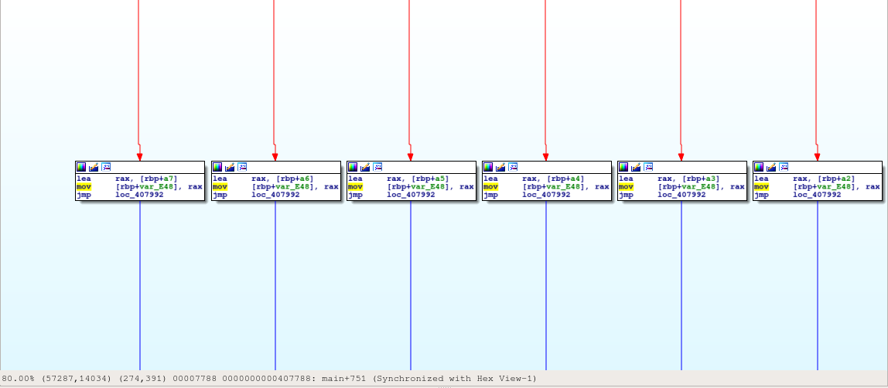

# bananaScript
## Reversing 450

#### shareef12

    Not too sure how to Interpret this, the lab member who wrote this "forgot" to
    write any documentation. This shit, and him, is bananas. B, A-N-A-N-A-S.

We were initially given two files for this challenge; an ELF binary `monkeyDo`
and a text file `banana.script`. At some point on Saturday the organizers
released two additional script files: `test1.script` and `test2.script`.

    user@reversing:~/csaw/bananascript$ file *
    banana.script: ASCII text, with very long lines, with CRLF line terminators
    monkeyDo:      ELF 64-bit LSB executable, x86-64, version 1 (SYSV),
    dynamically linked, interpreter /lib64/ld-linux-x86-64.so.2, for GNU/Linux
    2.6.32, BuildID[sha1]=4e3e2b95c29bcb0f0da9761171d309ce92564cb2, stripped
    test1.script:  ASCII text, with CRLF line terminators
    test2.script:  ASCII text, with CRLF line terminators

Based on the description, `monkeyDo` is probably an interpreter for each of the script files. Running banana.script gives us the following results.

    user@reversing:~/csaw/bananascript$ ./monkeyDo banana.script
    Hello! And welcome to the Flying Monkeys' Fantastic Falling Fan Trivia Game.

    Here, the council of monkeys will ask you questions, which will determine whether they choose to lift you away save you from your plummeting fate.

    "WRITE DOWN YOUR AGE," speaks the elder monkey.

    ...Only now do you notice the immense amount of banananasPiled around you on this falling stone platform.. The bananananasSeem to be used for everything, from the obvious food source to building materials to tooth brushes to toys to even glasses, but you can't imagine how well one could see through a pair of K-Vision goggles.

    One such monkey wearing these goggles hobbles up to you now, carrying a pile of limp banananananasSkins and a bananananananaPointPen. As this monkey hands you these materials, the black ends of the banananananananas(Where eyes might ought to go?) seem to peer into your soul, as though they know everything and more that there is to know about you, and they are very, very deeply conflicted about you due to a familial disagreement back in the chain... "Disgrace to our fine culture," you think you hear, but so soft that it could have just been the wind.  The monkey moves in closer and closer, so close that it could, and actually does bump into you, obviously unaware of where you are due to some odd oblong fruit obscuring its vision.

    test_input_1

    ~How can monkeys talk? And why am I following you their commands?~

    "WRITE DOWN YOUR SSN/CVV's/privatekeys- err I mean favorite food!," speaks the elder monkey.
    test_input_2

    "GASP!" All the monkeys are dreadfully appaled, some of them even start to cry.  "How could you?" spits one monkey, covering the eyes of their child.  The conglomerate of monkeys take off from the platform, leaving you to fall to your death.

At this point we need to find a way to determine what inputs are valid for these
questions. To do this, I started static analysis of `monkeyDo` in order to build
a simple disassembler for the scripts. Opening it up in IDA, we see one of the
ugliest control flow graphs for `main()`. Due to the lack of other functions, we
can assume the bulk of the disassembler is implemented in this function.



To name some of the c++ functions correctly, I created a test program with some
c++ std types, compiled, and disassembled in order to compare functionality.
Many of the top-level vector functions seemed to be exactly the same.

After verifying the correct argument count, we encounter the following basic
block, which calls two functions. The first, `read_lines` reads each line from
the input script file, and splits each line by whitespace, returning a vector of
lines, where each line is a vector of words.



The second function seems to initialize some form of hashmap mapping a "banana
string" to an ascii character. This hashmap will probably be used to translate
"banana strings" to ascii strings.



Following this, we initialize 16 `std::basic_string` objects on the stack, which
happen to be the "registers" for this interpreter. In the picture below, the
first 8 registers are named r0-r8, and the next 8 a0-a8.



Initially I didn't make the connection that these were the registers of the
interpreter until I started looking at some of the instructions. What gave it
away was for many instructions there was a cascading sequence of comparisons for
a specific "banana string" and moving the address of one of these registers into
a specific location. Essentially this was the machine choosing a register to
operate on given a specific instruction operand.

In the below images, we see that the fourth word in the line (index 3) is an
operand. Based on the capitalization of the word "banANANS", we choose a
corresponding register to operate on. It seems all registers started with
"banA", and the remaining text corresponds to the binary value of the register
index, with uppercase being a 1 and lowercase being a 0.

    banANAS = r7 or a7
    banANAs = r6 or a6
    banANaS = r5 or a5
    ...
    banAnas = r0 or a0




After reversing a few of the opcodes and making extremely slow progress, I
decided to move to a more dynamic analysis. The interpreter loops through each
line, with the start of loop at `0x4074d7`. If we set a breakpoint at this
address and dump the machine registers, we can step through a script file
manually. To automate this process, I created a [gdb init script](.gdbinit) that
defined some useful functions, automatically set a breakpoint, and loaded
`banana.script`.

To help decode some of the runtime banana strings, I also wrote a simple
[python script](convert.py) to decode them.

    user@reversing:~/csaw/bananascript$ gdb monkeyDo
    Reading symbols from monkeyDo...(no debugging symbols found)...done.
    Breakpoint 1 at 0x4074d7

    Breakpoint 1, 0x00000000004074d7 in ?? ()
    => 0x00000000004074d7:    48 8d 85 f0 f2 ff ff    lea    rax,[rbp-0xd10]

     line: 0x7fffffffd210:    0x00000000

     r0: 0x7fffffffd4d0:    ""
     r1: 0x7fffffffd4b0:    ""
     r2: 0x7fffffffd490:    ""
     r3: 0x7fffffffd470:    ""
     r4: 0x7fffffffd450:    ""
     r5: 0x7fffffffd430:    ""
     r6: 0x7fffffffd410:    ""
     r7: 0x7fffffffd3f0:    ""

     a0: 0x7fffffffd5d0:    ""
     a1: 0x7fffffffd5b0:    ""
     a2: 0x7fffffffd590:    ""
     a3: 0x7fffffffd570:    ""
     a4: 0x7fffffffd550:    ""
     a5: 0x7fffffffd530:    ""
     a6: 0x7fffffffd510:    ""
     a7: 0x7fffffffd4f0:    ""
    (gdb) c
    Continuing.

    Breakpoint 1, 0x00000000004074d7 in ?? ()
    => 0x00000000004074d7:    48 8d 85 f0 f2 ff ff    lea    rax,[rbp-0xd10]

     line: 0x7fffffffd210:    0x00000001

     ...
     ...
     ...
    (gdb) c
    Continuing.

    Breakpoint 1, 0x00000000004074d7 in ?? ()
    => 0x00000000004074d7:    48 8d 85 f0 f2 ff ff    lea    rax,[rbp-0xd10]

     line: 0x7fffffffd210:    0x00000002

     ...
     ...
     ...
    (gdb) c
    Continuing.

    Breakpoint 1, 0x00000000004074d7 in ?? ()
    => 0x00000000004074d7:    48 8d 85 f0 f2 ff ff    lea    rax,[rbp-0xd10]

     line: 0x7fffffffd210:    0x00000003

     ...
     ...
     ...
    (gdb) c
    Continuing.

    Breakpoint 1, 0x00000000004074d7 in ?? ()
    => 0x00000000004074d7:    48 8d 85 f0 f2 ff ff    lea    rax,[rbp-0xd10]

     line: 0x7fffffffd210:    0x00000004

     r0: 0x62e2b0:    "baNANAs banAnAS banANaS banaNAs BANANAs BANaNas BANAnas bANanAS baNaNAs banaNAs bANaNas BaNaNaS baNanas BaNaNas BaNanas BaNANas baNAnaS banaNAS bANAnAs banANAS bAnaNAs BANAnAS BANAnas BaNANas bAnANas "...
     r1: 0x62e0d0:    "BAnaNas BANANAS BAnAnAs BANANAS BAnAnAs BANANAS"
     r2: 0x7fffffffd490:    ""
     r3: 0x7fffffffd470:    ""
     r4: 0x7fffffffd450:    ""
     r5: 0x7fffffffd430:    ""
     r6: 0x7fffffffd410:    ""
     r7: 0x62e690:    "BaNANAs BANAnAS BANaNas BANaNas BANanaS bANaNas BanAnAS BAnaNaS BANanAs BANANas BanAnAS BAnAnaS BANAnAS BANaNas BANANaS BANanaS BANanAS BANAnAS BanAnAS BAnANas BANanaS BanAnAS BAnANas BANAnas BANAnAS "...

     a0: 0x7fffffffd5d0:    ""
     a1: 0x7fffffffd5b0:    ""
     a2: 0x7fffffffd590:    ""
     a3: 0x7fffffffd570:    ""
     a4: 0x7fffffffd550:    ""
     a5: 0x7fffffffd530:    ""
     a6: 0x7fffffffd510:    ""
     a7: 0x7fffffffd4f0:    ""


    user@reversing:~/csaw/bananascript$ ./convert.py
    > BaNANAs BANAnAS BANaNas BANaNas BANanaS bANaNas BanAnAS BAnaNaS BANanAs BANANas BanAnAS BAnAnaS BANAnAS BANaNas BANANaS BANanaS BANanAS BANAnAS BanAnAS BAnANas BANanaS BanAnAS BAnANas BANAnas BANAnAS
    Hello! And welcome to the

    >

At this point, it's time to start reversing specific operands. Since `monkeyDo`
seemed to implement many more opcodes that the script used, I started with the
first instruction in the script and began reversing to figure out what that line
did, and implemented that functionality in the disassembler. This step probably
took the longest amount of time. `banana.script` ended up using 8 different
operations.

1. store rX, CONST - Store a constant banana string in a general purpose
    register.
2. store aX, CONST - Store a constant banana string in an arithmetic register
2. xor   rX, rY    - Perform a repeated xor of rX and rY for the length of rX,
    storing the result in rX.
3. put   rX        - Convert register banana string to ascii and print to stdout
4. get   rX        - Get ascii input, convert to banana string, and store in register
    rX.
5. sge   rX, rY    - Hash two registers, and skip the next instruction if rX > rY.
    The hash always appeared to be greater if len(rX) > len(rY)
6. se    rX, rY    - Skip if equal
7. jmp   aX        - Jump forward the amount of instructions indicated in register aX.
8. mix   rX, rY    - Mix the input of rY into rX (I didn't spend the time to fully
    reverse this operation).

The full disassembly of banana.script using the custom
[disassembler](disassemble.py) is below.

    user@reversing:~/csaw/bananascript$ ./disassemble.py banana.script
     0: store r0, "baNANAs banAnAS banANaS banaNAs BANANAs BANaNas BANAnas bANa..."
     1: store r7, "bANaNas banaNas baNANAs banAnAS baNaNaS BanAnAS bAnanaS baNA..."
     2: store r1, "BAnaNas BANANAS BAnAnAs BANANAS BAnAnAs BANANAS"
     3: xor   r7, r1
     4: put   r7
     5: store r1, "BanAnAS"
     6: put   r1
     7: store r7, "bAnANAS banAnAs banAnAs banaNas BanaNaS bANAnAs baNANaS bana..."
     8: store r1, "BAnaNas BANANAS BANAnAs BANanaS BANanaS BANAnAs BANanaS BANa..."
     9: xor   r7, r1
     a: put   r7
     b: store r1, "BanAnAS"
     c: put   r1
     d: store r7, "BaNAnas bAnanaS bAnAnAs bAnaNAs bANANas baNanAS bANanas banA..."
     e: store r1, "BANANAs BANAnAS BAnANAs BANanAs BANAnAS BAnANAs BANanAs BANA..."
     f: xor   r7, r1
    10: put   r7
    11: store r1, "BanAnAS"
    12: put   r1
    13: store r7, "BAnAnAs BaNAnAS BAnAnas bananaS baNanAS baNaNAs bANAnAs baNa..."
    14: store r1, "BaNANaS BaNAnaS BaNanAs BaNaNas BAnaNaS BaNaNAs BaNaNAs BAna..."
    15: xor   r7, r1
    16: put   r7
    17: store r1, "BanAnAS"
    18: put   r1
    19: store r7, "bAnaNaS banANaS banAnaS bANaNas bananas baNANas baNanas bANA..."
    1a: store r1, "BANANAs BANANAS BANanAs BANANAS BANanAs BANANAS BAnANaS BANa..."
    1b: xor   r7, r1
    1c: put   r7
    1d: store r1, "BanAnAS"
    1e: put   r1
    1f: get   r7
    20: store a7, "BanaNAS"
    21: store a6, "Bananas"
    22: store r2, "BanAnas BananaS"
    23: sge   r7, r2
    24: jmp   a7
    25: jmp   a6
    26: store r1, "BanAnAS"
    27: put   r1
    28: store r7, "BaNaNas bANanas banaNAs baNanAS bANAnAs bANaNaS banAnaS bANa..."
    29: store r1, "BAnAnaS BaNANAs BAnaNAS BAnanAs BANaNAS BAnanAs BANaNAS BAna..."
    2a: xor   r7, r1
    2b: put   r7
    2c: store a7, "BanaNAS BanAnaS BanAnaS"
    2d: jmp   a7
    2e: put   r1
    2f: store r1, "BanaNas bAnANAS bananas baNaNAS bANaNas banANAS banANAs bana..."
    30: store r2, "BANANAs BANANAS BANanAs BANanaS BANanAs BANanaS BANanaS BANa..."
    31: xor   r1, r2
    32: put   r1
    33: store r1, "BanAnAS"
    34: put   r1
    35: store r4, "BaNaNAS baNAnaS bAnaNaS bAnaNaS banANaS bANaNAs bAnAnaS baNA..."
    36: store r1, "BANanaS BANAnas BaNANAS BaNaNAS BAnanAs BANAnas BANAnAS BANa..."
    37: xor   r4, r1
    38: put   r4
    39: get   r4
    3a: store r2, "BAnaNas BANANAS BANanAs BANANAS BaNAnas BAnaNaS BAnANaS bANa..."
    3b: store a7, "BanaNAS"
    3c: store a6, "Bananas"
    3d: se    r4, r2
    3e: jmp   a7
    3f: jmp   a6
    40: store r1, "BanAnAS"
    41: put   r1
    42: store r4, "BaNanas bAnAnas banAnas bANANAs bANAnAs BanANas BaNAnas baNA..."
    43: store r1, "BANaNAS BANanAS BANaNAS BAnANaS BAnANaS BAnANas BANAnas BANA..."
    44: xor   r4, r1
    45: put   r4
    46: store a7, "BanaNAS BanAnaS BanAnaS"
    47: jmp   a7
    48: store r1, "BanAnAS"
    49: put   r1
    4a: store r1, "banaNAS bANANas banAnaS baNaNaS bANANAs banANas banAnAs bAnA..."
    4b: store r2, "bANanAs BANanAS BANanaS BANanAs BANaNaS BANAnAS BAnaNAS BAna..."
    4c: xor   r1, r2
    4d: put   r1
    4e: store r1, "BanaNas bAnAnaS bananAS bANanas bAnANas bAnanaS bAnaNaS baNA..."
    4f: store r2, "BaNANas BANanaS BANaNAS BANanAs BaNAnaS BAnaNAS BaNANaS BaNa..."
    50: xor   r1, r2
    51: put   r1
    52: store r1, "BanAnAS"
    53: put   r1
    54: store r5, "BaNaNaS bANAnAs banAnaS bAnANAs bANanAs bANANas baNanAS bana..."
    55: store r1, "BANanAs BANanaS BANaNAs BANaNaS BaNANaS BANanAS BAnanas BaNA..."
    56: xor   r5, r1
    57: put   r5
    58: get   r5
    59: store r1, "BanAnAS"
    5a: put   r1
    5b: store r1, "BAnanaS banAnAS banAnaS bANAnAs bANanaS bAnAnAS baNaNaS baNA..."
    5c: store r2, "BANaNAS BanANAS BaNaNAS BaNAnas BAnanAs BAnanaS BaNaNas BAnA..."
    5d: xor   r1, r2
    5e: put   r1
    5f: store r1, "BanAnAS"
    60: put   r1
    61: store r6, "BANAnAS bAnAnAs banANas bANAnas banAnAs banaNas bANaNaS baNA..."
    62: store r2, "BANANAs BANANAS BaNAnas BAnaNaS BaNAnas BAnaNaS BaNAnas BAna..."
    63: xor   r6, r2
    64: put   r6
    65: get   r6
    66: put   r1
    67: store r1, "BanANAs bANaNaS banaNAS baNANas baNanAS baNanas bANAnAS bAna..."
    68: store r2, "BANANAS BANanas BANanas BANaNas BANAnAS BAnANaS BANANAS BAnA..."
    69: xor   r1, r2
    6a: put   r1
    6b: store r1, "BanAnAS"
    6c: put   r1
    6d: mix   r4, r7
    6e: mix   r4, r6
    6f: mix   r4, r5
    70: xor   r0, r4
    71: store r3, "BanANaS bAnAnaS baNaNAs baNANAS baNaNAs bANANas baNAnaS baNA..."
    72: store r2, "BANanaS BAnANaS BANaNAS BAnANAs BANaNAS BAnANaS"
    73: xor   r3, r2
    74: put   r3
    75: put   r0

Examining this disassembly, we find that the answers the first two questions are
probably "18" for the first question, and "BanaNAs!" for the second. Assuming we
pass the second question prompt, we see that all four of our answers are mixed
together using a mix operation, and that result is used as a rolling xor key
with a banana string constant to generate the flag.

Since all answers are mixed into the answer for the second question, we know
that the key length is 8 bytes. Since we also know that the flag will probably
start with "flag{", we can calculate the first 5 bytes of the xor key and brute
force the rest.

```python
#!/usr/bin/env python

import itertools
import string

from convert import encoding
import disassemble

FLAG_CHARS = string.ascii_letters + string.digits + "_"

banana_ct = "baNANAs banAnAS banANaS banaNAs BANANAs BANaNas BANAnas bANanAS baNaNAs banaNAs bANaNas BaNaNaS baNanas BaNaNas BaNanas BaNANas baNAnaS banaNAS bANAnAs banANAS bAnaNAs BANAnAS BANAnas BaNANas bAnANas BaNaNaS banAnAs bANAnAs baNaNas BanaNaS bANANas banaNas bAnANaS bANANaS BaNAnas baNanAs baNanAS BaNAnAs bANANas banAnas bAnanaS banANaS bANaNAS banANaS baNanAS BaNanAS BANAnAS BaNanaS"

tokens = disassemble.tokenize(banana_ct)
ct = [t.val for t in tokens]

def rolling_xor(ct, key):
    pt = []
    for i, c in enumerate(ct):
        char = c ^ key[i % (len(key))]
        pt.append(char)
    return pt


key = [ 0x64, 0x7f, 0x72, 0x7f, 0x56]
#for i in xrange(256):
#    try:
#        if encoding[i ^ ct[4]] == '{':
#            print hex(i)
#            exit(1)
#    except:
#        pass

for i, seq in enumerate(itertools.product(range(256), repeat=3)):
    guess = key + list(seq)
    pt = rolling_xor(ct, guess)
    try:
        pt = "".join(encoding[c] for c in pt)
        if all(c in string.printable for c in pt) and pt[-1] == "}" and \
           all(c in FLAG_CHARS for c in pt[5:-1]):
            print pt
    except:
        pass
```

Running this script produces 52 flags, the last one of which was the solution.

    flag{lr4ng3_3R3_ch1pper_1_h474_n07_s4L_b4n4n4Ss}
    flag{kr4ng3_3Q3_ch1ppfr_1_h475_n07_s4K_b4n4n4Ts}
    flag{jr4ng3_3P3_ch1ppgr_1_h472_n07_s4N_b4n4n4Us}
    flag{ir4ng3_3O3_ch1pphr_1_h473_n07_s4M_b4n4n4Vs}
    flag{pr4ng3_3V3_ch1ppar_1_h478_n07_s4H_b4n4n4Os}
    flag{or4ng3_3U3_ch1ppbr_1_h479_n07_s4G_b4n4n4Ps}
    flag{nr4ng3_3T3_ch1ppcr_1_h476_n07_s4J_b4n4n4Qs}
    flag{mr4ng3_3S3_ch1ppdr_1_h477_n07_s4I_b4n4n4Rs}
    flag{dr4ng3_3J3_ch1ppmr_1_h47Y_n07_s4T_b4n4n4Ks}
    flag{cr4ng3_3I3_ch1ppnr_1_h47Z_n07_s4S_b4n4n4Ls}
    flag{br4ng3_3H3_ch1ppor_1_h47W_n07_s4V_b4n4n4Ms}
    flag{ar4ng3_3G3_ch1pppr_1_h47X_n07_s4U_b4n4n4Ns}
    flag{hr4ng3_3N3_ch1ppir_1_h470_n07_s4P_b4n4n4Gs}
    flag{gr4ng3_3M3_ch1ppjr_1_h471_n07_s4O_b4n4n4Hs}
    flag{zr4ng3_333_ch1ppwr_1_h47O_n07_s41_b4n4n48s}
    flag{yr4ng3_323_ch1ppxr_1_h47P_n07_s40_b4n4n49s}
    flag{Fr4ng3_393_ch1ppqr_1_h47U_n07_s4X_b4n4n42s}
    flag{Er4ng3_383_ch1pprr_1_h47V_n07_s4W_b4n4n43s}
    flag{Dr4ng3_373_ch1ppsr_1_h47S_n07_s4Z_b4n4n44s}
    flag{Cr4ng3_363_ch1pptr_1_h47T_n07_s4Y_b4n4n45s}
    flag{rr4ng3_3X3_ch1ppEr_1_h47G_n07_s49_b4n4n40s}
    flag{qr4ng3_3W3_ch1ppFr_1_h47H_n07_s48_b4n4n41s}
    flag{xr4ng3_313_ch1ppyr_1_h47M_n07_s43_b4n4n4Ws}
    flag{wr4ng3_303_ch1ppzr_1_h47N_n07_s42_b4n4n4Xs}
    flag{Rr4ng3_3l3_ch1ppKr_1_h47A_n07_s4f_b4n4n4ms}
    flag{Qr4ng3_3k3_ch1ppLr_1_h47B_n07_s4e_b4n4n4ns}
    flag{Pr4ng3_3j3_ch1ppMr_1_h47y_n07_s4h_b4n4n4os}
    flag{Or4ng3_3i3_ch1ppNr_1_h47z_n07_s4g_b4n4n4ps}
    flag{Vr4ng3_3p3_ch1ppGr_1_h47E_n07_s4b_b4n4n4is}
    flag{Ur4ng3_3o3_ch1ppHr_1_h47F_n07_s4a_b4n4n4js}
    flag{Tr4ng3_3n3_ch1ppIr_1_h47C_n07_s4d_b4n4n4ks}
    flag{Sr4ng3_3m3_ch1ppJr_1_h47D_n07_s4c_b4n4n4ls}
    flag{Jr4ng3_3d3_ch1ppSr_1_h47s_n07_s4n_b4n4n4es}
    flag{Ir4ng3_3c3_ch1ppTr_1_h47t_n07_s4m_b4n4n4fs}
    flag{Hr4ng3_3b3_ch1ppUr_1_h47q_n07_s4p_b4n4n4gs}
    flag{Gr4ng3_3a3_ch1ppVr_1_h47r_n07_s4o_b4n4n4hs}
    flag{Nr4ng3_3h3_ch1ppOr_1_h47w_n07_s4j_b4n4n4as}
    flag{Mr4ng3_3g3_ch1ppPr_1_h47x_n07_s4i_b4n4n4bs}
    flag{Lr4ng3_3f3_ch1ppQr_1_h47u_n07_s4l_b4n4n4cs}
    flag{Kr4ng3_3e3_ch1ppRr_1_h47v_n07_s4k_b4n4n4ds}
    flag{3r4ng3_3z3_ch1pp0r_1_h47i_n07_s4x_b4n4n4Es}
    flag{2r4ng3_3y3_ch1pp1r_1_h47j_n07_s4w_b4n4n4Fs}
    flag{9r4ng3_3F3_ch1ppWr_1_h47o_n07_s4r_b4n4n4ys}
    flag{8r4ng3_3E3_ch1ppXr_1_h47p_n07_s4q_b4n4n4zs}
    flag{7r4ng3_3D3_ch1ppYr_1_h47m_n07_s4t_b4n4n4As}
    flag{6r4ng3_3C3_ch1ppZr_1_h47n_n07_s4s_b4n4n4Bs}
    flag{Zr4ng3_3t3_ch1pp6r_1_h47c_n07_s4D_b4n4n4us}
    flag{Yr4ng3_3s3_ch1pp7r_1_h47d_n07_s4C_b4n4n4vs}
    flag{Xr4ng3_3r3_ch1pp8r_1_h47a_n07_s4F_b4n4n4ws}
    flag{Wr4ng3_3q3_ch1pp9r_1_h47b_n07_s4E_b4n4n4xs}
    flag{1r4ng3_3x3_ch1pp2r_1_h47g_n07_s4z_b4n4n4qs}
    flag{0r4ng3_3w3_ch1pp3r_1_h47h_n07_s4y_b4n4n4rs}

#### Shortcuts

Solving this challenge may have been much faster from a purely dynamic
perspective. Dumping the registers and examining the transformations from that
perspective would have almost certainly been faster and easier. The provided
script was fairly naive with only two operations that mixed the contents of
registers. Furthermore, if one realizes that the flag result is simply a rolling
xor between two registers, it would have been trivial to skip the majority of
static reversing of earlier opcodes and skip straight to analysis of the final
xor.
