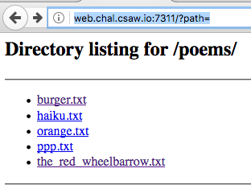
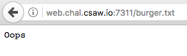
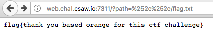

# Orange v1
## 100 points
## Web

### I wrote a little proxy program in NodeJS for my poems folder.
### Everyone wants to read flag.txt but I like it too much to share.
### http://web.chal.csaw.io:7311/?path=orange.txt

This challange was actually the an unintended solution for what became the 
`orange v3` challenge.

We're presented with some type of file getting proxy service where the filename
is a parameter in the URL. We can make a request with no url and it returns a
directory listing of the folder (notice no flag.txt in here):

When we click on one of the listed files (try to request them directly), we are
presented with what looks like their 404 error of `Oops`.

The same happens if we try to look in the `poems` folder as mentioned by the
challenge description.

The description does say that this is a proxy service, so these files appear to
be requested by the running web app from some other web service. Since we're
looking for a file that must be in a directory at least on level up, let's try
to figure out how to travese directories. It turns out, that by simply using 
[double url encoding](https://www.owasp.org/index.php/Double_Encoding), we can get the flag.

### flag: flag{thank_you_based_orange_for_this_ctf_challenge}