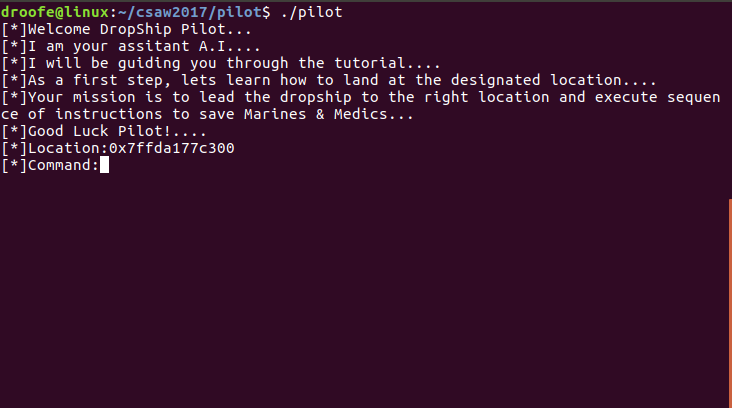
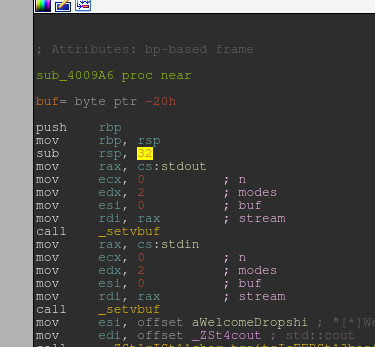
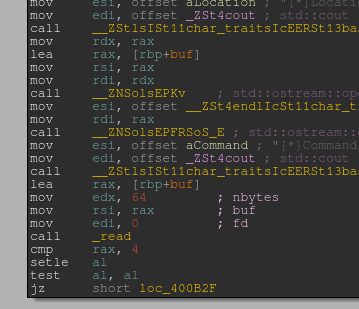
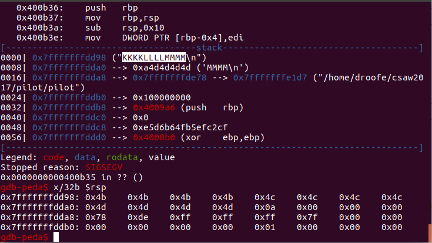
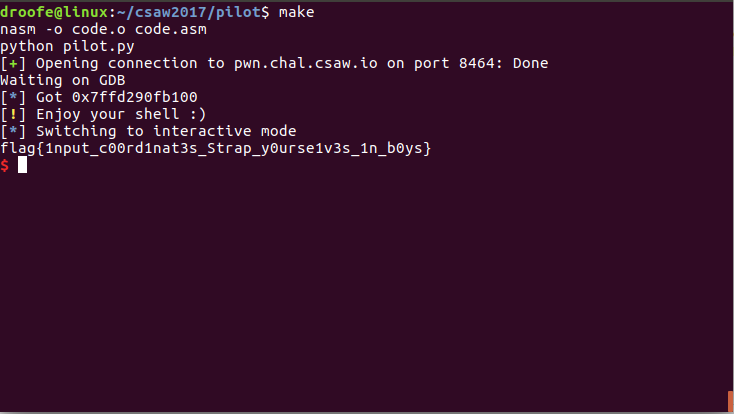

# pilot
#### droofe

This challenge was the lowest point pwnable, 75 points. When I ran the program, I got the prompt...

After adding some basic input, I realized nothing was happening, time to start the RE. After the initial RE I learned this was exploitable via a basic buffer overflow, as the stack was created with 32 bytes of space and further into the program, there is a read call into a buffer on the stack where `n` is 64 bytes. After further inspection I saw there was no stack cookie being validated, and the address of the buffer was given by the program.

|  |  |

In order to find the offset into RIP, I used the standard _test with the alphabet_ method, giving the input `AAAABBBBCCCCDDDDEEEEFFFFGGGGHHHHIIIIJJJJKKKKLLLLMMMM`.

This yielded the offset of 40 bytes into the buffer being where our value for RIP needs to be. A few issues I had were with my shellcode. Originally I assumed that I had 40 bytes of space to write shellcode with. However, I forgot that `rbp` and nearby values get clobbered as `leave` gets ran, so I had to shorten my payload to < 25 bytes.

`pilot.py` is the exploit I created. It uses pwntools to open the process or remote service, read the address of the buffer, and send the shellcode assembled from `code.asm`. The shellcode does a syscall to `execve(["/bin/sh"],[],[])`, which ultimately lands us the shell.

