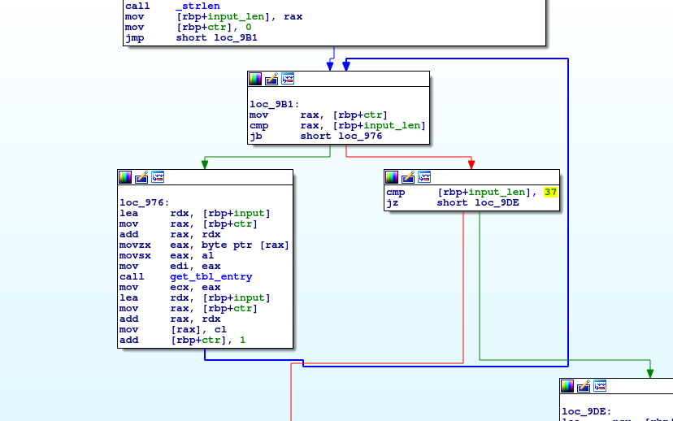

# tablEZ
## Reversing 100

#### shareef12

    Bobby was talking about tables a bunch, so I made some table stuff. I think
    this is what he was talking about...

This was the first reversing challenge for csaw. Unstripped x86-64 binary that
simply asked for a flag and exited.

    user@reversing:~/csaw/tablEZ$ file tablEZ
    tablEZ: ELF 64-bit LSB shared object, x86-64, version 1 (SYSV), dynamically
    linked, interpreter /lib64/ld-linux-x86-64.so.2, for GNU/Linux 3.2.0,
    BuildID[sha1]=72adea86090fb7deeb319e95681fd2c669dcc503, not stripped
    user@reversing:~/csaw/tablEZ$ ./tablEZ
    Please enter the flag:
    aaaa
    WRONG

Some static reversing reveals the binary was pretty small, with the main
function looping through the input and replacing each character with the result
of `get_tbl_entry`. After checking the length of the input (has to be 37), it is
compared with an "encrypted" copy of the flag.

`get_tbl_entry` uses a substitution table to replace bytes. The substitution
table is 512 bytes, consisting of 256 key-value pairs of bytes.

All we have to do is pull out the encrypted flag bytes, the substitution tables,
and reverse the algorithm. I used an [idapython script](solve.py) to do this.

    flag{t4ble_l00kups_ar3_b3tter_f0r_m3}
